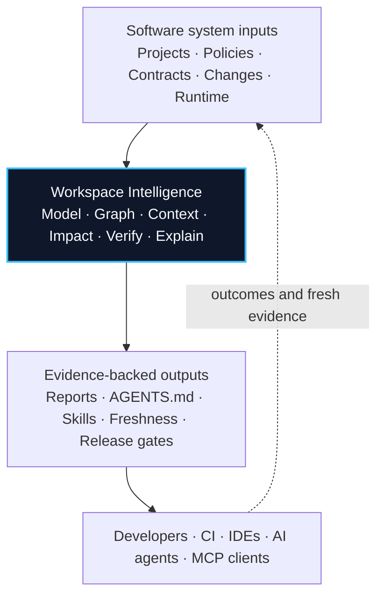

<div align="center">

# Workspai

## Open-Source Workspace Intelligence for Software Systems

One evidence-backed understanding of your software system for developers, CI,
IDEs, and AI agents.

[Website](https://www.workspai.com) · [Learn](https://workspai.dev) · [GitHub](https://github.com/rapidkitlabs/workspai) · [npm](https://www.npmjs.com/package/workspai) · [VS Code](https://marketplace.visualstudio.com/items?itemName=rapidkit.rapidkit-vscode)

</div>

---

## Why Workspai

AI tools can read code. Software systems also contain runtime boundaries,
dependencies, policies, ownership, operational evidence, and release decisions.

Workspai adds the missing workspace layer:



It is not another coding agent. It gives coding agents and engineering tools a
better, shared understanding to work from.

## Start With Existing Software

```bash
npx workspai adopt ../existing-project --json
cd ~/.workspai/workspaces/workspai
npx workspai workspace model --json --write
npx workspai workspace context --for-agent --json --write
npx workspai workspace agent-sync --write --refresh-context
npx workspai workspace verify --strict --json
```

Adopt keeps a project in place. Import brings it into the workspace boundary.
Supported create kits are available for teams starting new projects, but the
architecture is designed to meet existing software where it already lives.

## Product Surfaces

| Surface | Responsibility |
| --- | --- |
| [Workspai CLI](https://github.com/rapidkitlabs/workspai) | Canonical Workspace Intelligence engine and command surface |
| [Workspai for VS Code](https://github.com/rapidkitlabs/rapidkit-vscode) | Visual workspace operations, evidence, repair, and AI workflows |
| [Workspai.dev](https://workspai.dev) | Concepts, architecture, contracts, guides, and CLI reference |
| [Workspai.com](https://www.workspai.com) | Product experience and future online Workspace Intelligence surfaces |
| [RapidKit Core](https://github.com/rapidkitlabs/rapidkit-core) | Python engine used by core-backed generation and doctor workflows |

## Shared Outputs

```text
.workspai/reports/workspace-model.json
.workspai/reports/workspace-context-agent.json
.workspai/reports/workspace-impact-last-run.json
.workspai/reports/workspace-verify-last-run.json
.workspai/reports/agent-customization-pack.json
AGENTS.md · Skills · Cursor · Copilot · Claude
```

---

<div align="center">

Built in the open by [RapidKit Labs](https://www.getrapidkit.com).

</div>
