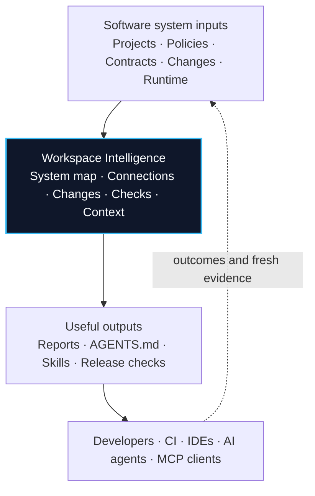

<div align="center">

# Workspai

## Open-Source Workspace Intelligence for Software Systems

One reliable view of your software system for developers, CI, IDEs, and AI
agents.

[Website](https://www.workspai.com) · [Learn](https://www.workspai.dev) · [GitHub](https://github.com/chistiq/workspai) · [npm](https://www.npmjs.com/package/workspai) · [VS Code](https://marketplace.visualstudio.com/items?itemName=rapidkit.rapidkit-vscode)

</div>

---

## Why Workspai

AI tools can read files. A real software system also includes several projects,
dependencies, APIs, deployment files, documentation, rules, tests, and release
checks.

Workspai connects these parts so people and tools do not have to rebuild a
different picture of the system every time:



It is not another chat or coding agent. It gives your existing tools a shared
and checkable understanding of the software.

## Turn Existing Software Into Shared Intelligence

Keep your repository where it is. In two minutes, Workspai can give developers,
CI, IDEs, and AI agents the same view of the system.

```bash
cd /absolute/path/to/project
npx workspai adopt .
```

`adopt` keeps the project in place and creates or reuses a minimal workspace in
your default Workspai location. Without the VS Code extension, copy the exact
`Next shell step` printed by the CLI, then continue in that workspace terminal:

```bash
cd ~/.workspai/workspaces/workspai
npx workspai workspace intelligence run --for-agent generic --strict --json
```

Use `generic` for vendor-neutral context, or choose `codex`, `claude`,
`cursor`, or `orca`. The same chain also syncs shared grounding for GitHub
Copilot, VS Code, and `AGENTS.md` consumers.

One command maps the system, connects related parts, checks what a change may
affect, runs health and release checks, and prepares focused context for AI
tools. Results are saved under `.workspai/`; the source project is not moved or
copied. If something is not ready, Workspai shows the reason and the files or
reports behind it.

## Products

| Product | What it does |
| --- | --- |
| [Workspai CLI](https://github.com/chistiq/workspai) | Creates and connects workspaces, maps systems, checks changes, and prepares shared context |
| [Workspai for VS Code](https://github.com/chistiq/rapidkit-vscode) | Shows workspace status, reports, repair actions, and AI workflows inside VS Code |
| [Workspai.dev](https://www.workspai.dev) | Guides, concepts, command reference, and technical documentation |
| [Workspai.com](https://www.workspai.com) | Product overview and the full Workspai experience |
| [RapidKit Core](https://github.com/chistiq/rapidkit-core) | Python tools for project generation, modules, setup, and health checks |

## Files Workspai Creates

```text
.workspai/reports/workspace-model.json
.workspai/reports/workspace-context-agent.json
.workspai/reports/workspace-impact-last-run.json
.workspai/reports/workspace-verify-last-run.json
.workspai/reports/agent-customization-pack.json
AGENTS.md · Skills · Cursor · Copilot · Claude
```

---

<div align="center">

Built in the open by [Chistiq](https://chistiq.com), the intelligence
infrastructure company behind RapidKit and Workspai.

</div>
